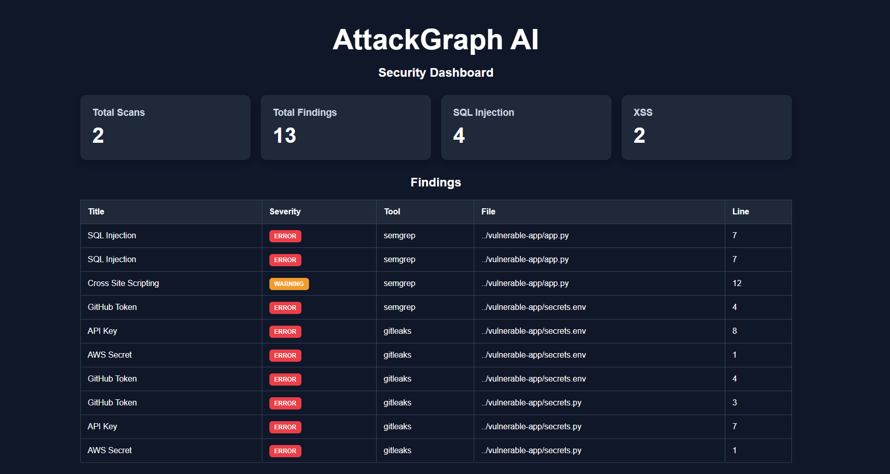
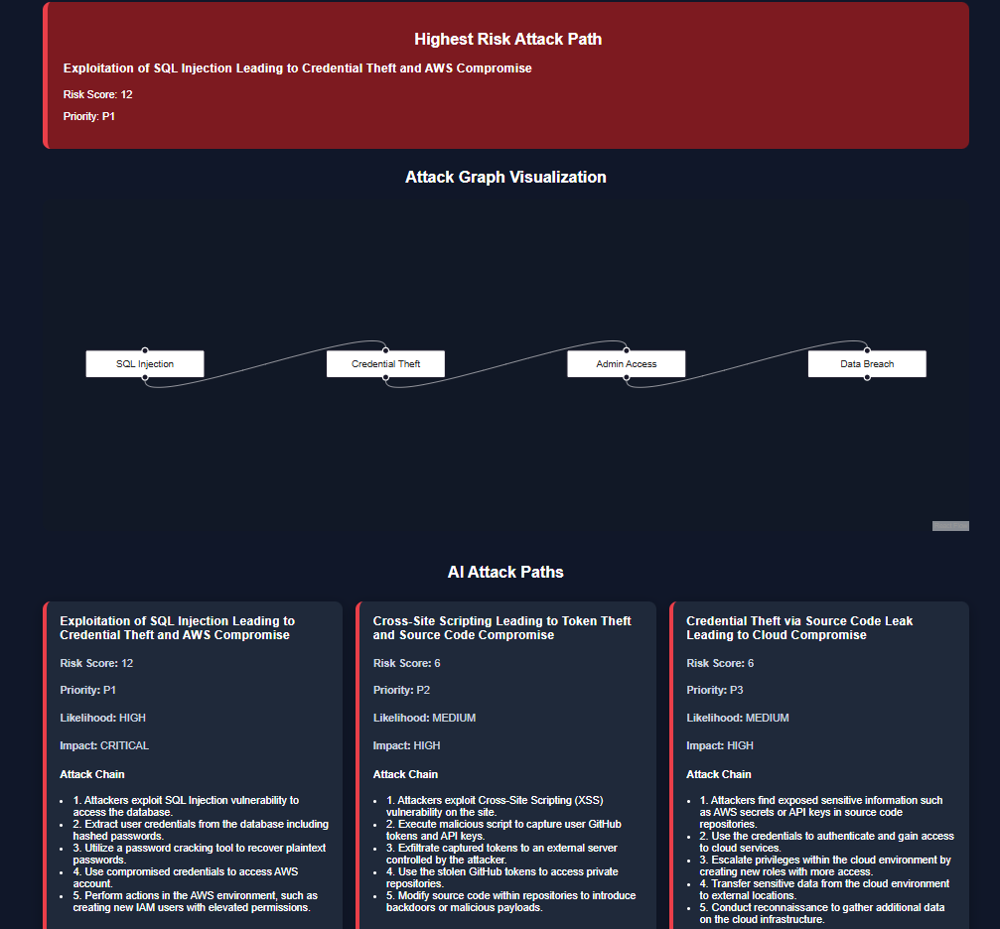

# AttackGraph AI

AttackGraph AI is an AI-powered application security platform that aggregates findings from multiple security tools, correlates related vulnerabilities, generates exploitability analysis, maps attack techniques to MITRE ATT&CK, and visualizes realistic attack paths to help security teams prioritize remediation.

## Overview

Modern security programs often receive thousands of findings from different scanners with little context regarding exploitability, attack chaining, or business impact.

AttackGraph AI addresses this problem by:

- Aggregating findings from multiple security scanners
- Normalizing and correlating related vulnerabilities
- Generating AI-driven exploitability assessments
- Producing remediation guidance
- Mapping attack techniques to MITRE ATT&CK
- Modeling realistic multi-stage attack paths
- Visualizing attack chains through an interactive attack graph

The platform enables security teams to move from individual findings to prioritized attack scenarios.

---

## Key Features

### Multi-Tool Security Scanning

- Semgrep Static Application Security Testing (SAST)
- Gitleaks Secret Detection
- Unified finding ingestion pipeline

### Finding Correlation Engine

- Vulnerability normalization
- Category-based correlation
- Duplicate detection
- Attack surface aggregation

### AI Security Analysis

- Exploitability assessment
- Confidence scoring
- Remediation recommendations
- Attack narrative generation

### Attack Path Analysis

- Multi-stage attack chain generation
- Risk scoring
- Likelihood assessment
- Business impact analysis
- MITRE ATT&CK mapping

### Interactive Visualization

- Executive security dashboard
- Attack graph visualization
- Correlated finding views
- Attack path prioritization

---

## Dashboard




## Attack Graph and Path Analysis



---

## Architecture

```text
Developer Code
        │
        ▼
 ┌─────────────┐
 │   Semgrep   │
 └─────────────┘
        │
        ▼
 ┌─────────────┐
 │  Gitleaks   │
 └─────────────┘
        │
        ▼
 ┌─────────────────┐
 │ Correlation     │
 │ Engine          │
 └─────────────────┘
        │
        ▼
 ┌─────────────────┐
 │ Attack Path     │
 │ Engine          │
 └─────────────────┘
        │
        ▼
 ┌─────────────────┐
 │ OpenAI GPT-4o   │
 └─────────────────┘
        │
        ▼
 ┌─────────────────┐
 │ React Dashboard │
 └─────────────────┘
```

---

## Technology Stack

### Frontend

- React
- TypeScript
- Axios
- ReactFlow

### Backend

- FastAPI
- SQLAlchemy
- SQLite

### Security Tooling

- Semgrep
- Gitleaks

### AI

- OpenAI GPT-4o-mini

---

## Example Attack Scenarios

AttackGraph AI can model attack chains such as:

### SQL Injection → Credential Theft → Privilege Escalation

An attacker exploits a vulnerable SQL query, extracts credentials from the database, and escalates privileges to gain administrative access.

### GitHub Token Exposure → Source Code Compromise

An exposed GitHub token provides access to source repositories containing proprietary code and additional secrets.

### AWS Secret Exposure → Cloud Resource Compromise

Compromised cloud credentials allow attackers to access and manipulate cloud resources, potentially leading to data breaches.

### XSS → Session Hijacking → Account Takeover

Cross-Site Scripting vulnerabilities enable session theft and user impersonation.

---

## Current Capabilities

- Multi-tool vulnerability scanning
- Secret detection
- Finding correlation
- AI exploitability analysis
- AI remediation recommendations
- MITRE ATT&CK mapping
- Attack path generation
- Risk scoring
- Attack graph visualization
- Executive risk prioritization

---

## Future Enhancements

### Security

- Trivy dependency scanning
- SBOM generation and analysis
- CVE enrichment
- Cloud attack path modeling
- Infrastructure security analysis

### AI

- Executive security summaries
- Risk trend analysis
- Automated threat modeling
- Security posture scoring

### Platform

- Neo4j graph database integration
- Multi-project support
- Historical scan tracking
- Team collaboration
- Real-time monitoring

---

## Getting Started

### Backend

```bash
cd backend

python -m venv venv

source venv/bin/activate

pip install -r requirements.txt

uvicorn app.main:app --reload
```

### Frontend

```bash
cd frontend

npm install

npm run dev
```

### Access

Backend API:

```text
http://localhost:8000/docs
```

Frontend Dashboard:

```text
http://localhost:5173
```

---

## Disclaimer

AttackGraph AI is intended for security research, education, and authorized security testing only.

Use only against systems and applications you own or are explicitly authorized to assess.